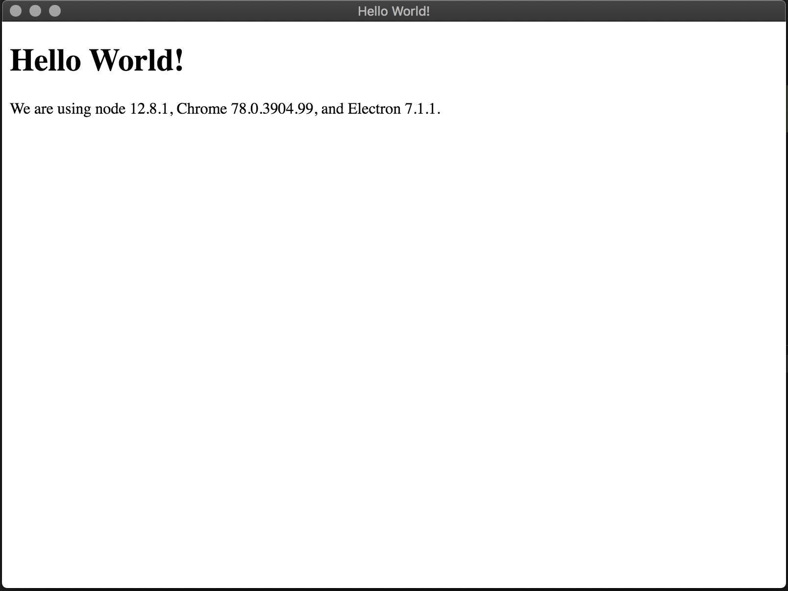

# Build an App with Electron and TypeScript - Getting Started

First, install TypeScript in the project's directory:
```bash
npm i -D typescript
```
<small>_**Note:** same as `npm install --save-dev typescript`_</small>

**`/tsconfig.json`**
```json
{
  "compilerOptions": {
    "incremental": true,
    "target": "es6",
    "module": "commonjs",
    "declaration": true,
    "declarationMap": true,
    "sourceMap": true,
    "outDir": "./dir",
    "rootDir": "./src",
    "composite": true,
    "isolatedModules": true,
    "strict": true,
    "noUnusedLocals": true,
    "noUnusedParameters": true,
    "noImplicitReturns": true,
    "noFallthroughCasesInSwitch": true,
    "moduleResolution": "node",
    "esModuleInterop": true,
    "experimentalDecorators": true,
    "emitDecoratorMetadata": true,
    "forceConsistentCasingInFileNames": true
  }
}
```
<small>_*Note:* [TypeScript config documentation](https://www.typescriptlang.org/docs/handbook/tsconfig-json.html)_</small>

TSLint will help to maintain code style:
```bash
npm i -D tslint
```

**`/tslint.json`**
```json
{
  "defaultSeverity": "error",
  "extends": ["tslint:recommended"]
}
```

Time to install Electron:
```bash
npm i -D electron
```

Create an `App` class.

**`/src/App.ts`**
```typescript
import path from "path";
import { BrowserWindow } from "electron";

export class App {
  /**
   * @description callback for Electron.App "ready" event
   */
  public onReady(): void {
    const options: Electron.BrowserWindowConstructorOptions = {
      height: 600,
      webPreferences: {
        nodeIntegration: true,
      },
      width: 800,
    };

    const window = new BrowserWindow(options);

    window.loadFile(path.join(__dirname, "../index.html"));
  }
}

```

And a HTML file to render the app.

**`/src/index.html`**
```html
<!DOCTYPE html>
<html lang="en">
  <head>
    <meta charset="UTF-8">
    <title>Hello World!</title>
    <!-- https://electronjs.org/docs/tutorial/security#csp-meta-tag -->
    <meta http-equiv="Content-Security-Policy" content="script-src 'self' 'unsafe-inline';" />
  </head>
  <body>
    <h1>Hello World!</h1>
    We are using node <script>document.write(process.versions.node)</script>,
    Chrome <script>document.write(process.versions.chrome)</script>,
    and Electron <script>document.write(process.versions.electron)</script>.
  </body>
</html>
```

And a NodeJS script to run it:
**`/src/bin/main.ts`**
```typescript
import Electron from "electron";

import { App } from "./App";

const app = new App();

Electron.app.on("ready", app.onReady);

```

Update package with build and start scripts.
 
**`package.json`**
```json
{
  // ...
  "main": "dist/bin/main.js",
  "scripts": {
    "build": "tsc",
    "prestart": "npm run build",
    "start": "electron .",
    // ...
  },
  //...
}
```

And try it:
```bash
npm start
```

The App should start running with something like this:
