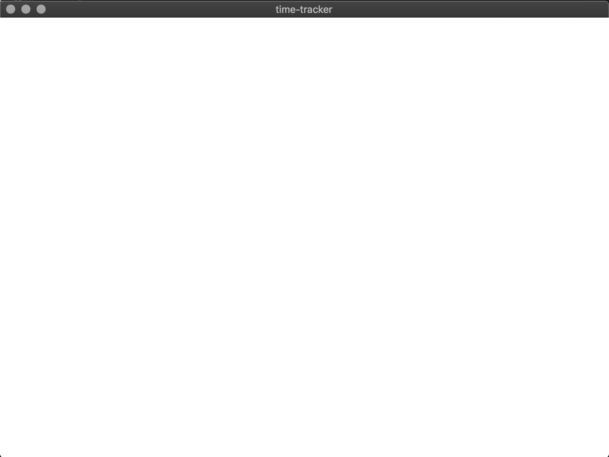

# Build an App with Electron and TypeScript - Getting Started

## Requirements

The environment/machine needs to have installed [NodeJS](https://nodejs.org/) v12 or higher.

Now in the project's directory (`~/develop/time-tracker`)

Install [TypeScript](https://www.typescriptlang.org/):
```bash
npm i -D typescript
```
<small>_**Note:** same as `npm install --save-dev typescript`_</small>

Create a [TypeScript config file](https://www.typescriptlang.org/docs/handbook/tsconfig-json.html).

**`/tsconfig.json`**
```json
{
  "compilerOptions": {
    "incremental": true,
    "target": "es6",
    "module": "commonjs",
    "declaration": true,
    "declarationMap": true,
    "sourceMap": true,
    "outDir": "./dir",
    "rootDir": "./src",
    "composite": true,
    "isolatedModules": true,
    "strict": true,
    "noUnusedLocals": true,
    "noUnusedParameters": true,
    "noImplicitReturns": true,
    "noFallthroughCasesInSwitch": true,
    "moduleResolution": "node",
    "esModuleInterop": true,
    "experimentalDecorators": true,
    "emitDecoratorMetadata": true,
    "forceConsistentCasingInFileNames": true
  }
}
```

Install [TSLint](https://palantir.github.io/tslint/), it will help to maintain code style:
```bash
npm i -D tslint
```

And create its config file.
**`/tslint.json`**
```json
{
  "defaultSeverity": "error",
  "extends": ["tslint:recommended"]
}
```

Time to install [Electron](https://electronjs.org/):
```bash
npm i -P electron
```
<small>_**Note:** same as `npm install --save-prod electron`_</small>

## Develop

### Most Basic Electron App

The easiest thing to do with Electron is to open a blank window.

The `App` class will be the main module for the project, for now it will only open an empty window when electron is ready.

**`/src/App.ts`**
```typescript
import Electron from "electron";

/**
 * Main module for the project
 */
export class App {
  /**
   * Starts the app
   */
  public start(): void {
    Electron.app.on("ready", this.onReady);
  }

  /**
   * Callback for Electron.App "ready" event
   */
  private onReady(): void {
    // tslint:disable-next-line: no-unused-expression
    new Electron.BrowserWindow();
  }
}

```

Now to use this module a good practice is to have an executable Node script that runs it, they are usually placed in a `bin/` directory.

**`/src/bin/start.ts`**
```typescript
import { App } from "./App";

const app: App = new App();
app.start();
```

Update package with build and start scripts.
 
**`/package.json`**
```json
{
  // ...
  "main": "dist/bin/start.js",
  "scripts": {
    "build": "tsc",
    "prebuild": "tslint --project tsconfig.json",
    "prestart": "npm run build",
    "start": "electron .",
    // ...
  },
  //...
}
```

And try it:
```bash
npm start
```

An empty window should appear:


### Rendering HTML in Electron

Electron's windows can load HTML files and render them.

Create a basic HTML file:
**`/index.html`**
```html
<!DOCTYPE html>
<html lang="en">
  <head>
    <meta charset="UTF-8">
    <title>Hello World!</title>
    <!-- https://electronjs.org/docs/tutorial/security#csp-meta-tag -->
    <meta http-equiv="Content-Security-Policy" content="script-src 'self' 'unsafe-inline';" />
  </head>
  <body>
    <h1>Hello World!</h1>
  </body>
</html>
```

Update `App` imports and `App.onReady` method:
**`/src/App.ts`**
```typescript
import Electron from "electron";
import path from "path"; // NodeJS path module

// ...
export class App {
  // ...
  private async onReady(): Promise<void> {
    const window: Electron.BrowserWindow = new Electron.BrowserWindow();

    await window.loadFile(path.join(__dirname, "../index.html"));
  }
}
```

Now if the app starts:
```bash
npm start
```

Should appear something like this:


In order to have integration with Node APIs, Electron's window needs to receive some options.

Update `App.onReady` method
**`/src/App.ts`**
```typescript
//...
export class App {
  //...
  private async onReady(): Promise<void> {
    const options: Electron.BrowserWindowConstructorOptions = {
      webPreferences: {
        nodeIntegration: true,
      },
    };

    const window: Electron.BrowserWindow = new Electron.BrowserWindow(options);

    await window.loadFile(path.join(__dirname, "../index.html"));
  }
}
```

And now the HTML has access to NodeJS APIs.

Update `index.html` file

**`/index.html`**
```html
<!DOCTYPE html>
<html lang="en">
  <head>
    <!-- ... -->
  </head>
  <body>
    <h1>Hello World!</h1>
    We are using node <script>document.write(process.versions.node)</script>,
    Chrome <script>document.write(process.versions.chrome)</script>,
    and Electron <script>document.write(process.versions.electron)</script>.
  </body>
</html>
```

When App starts:


And some debugging tools for Electron ([`devtron`](https://github.com/electron-userland/devtron) and [`electron-debug`](https://github.com/sindresorhus/electron-debug)).
```bash
npm i -D devtron electron-debug
```