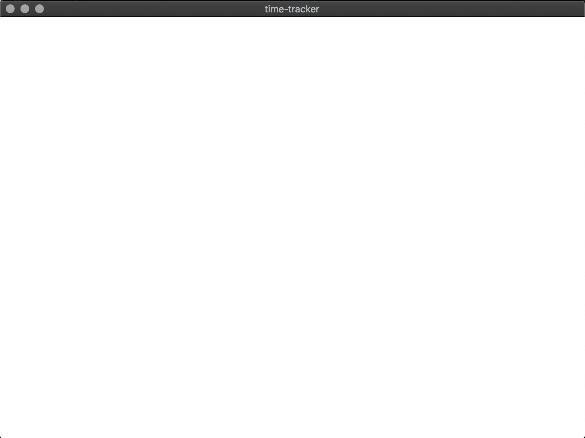
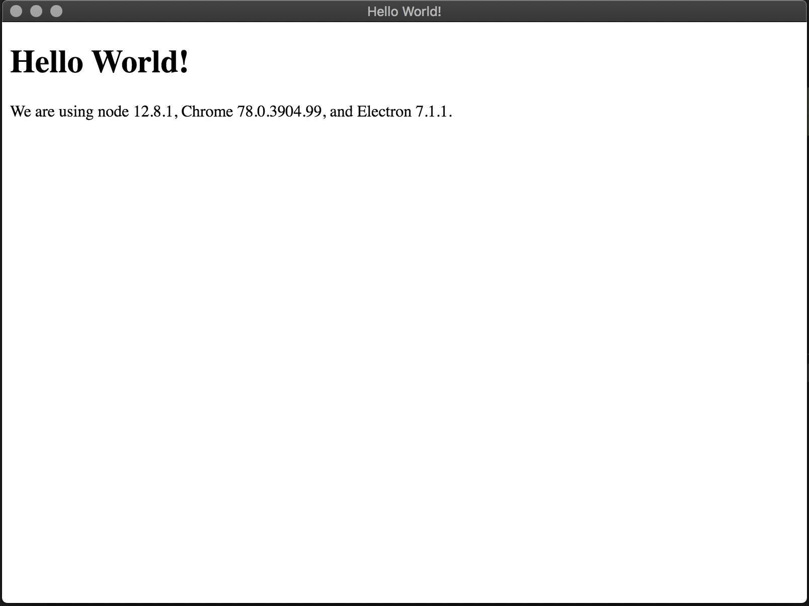
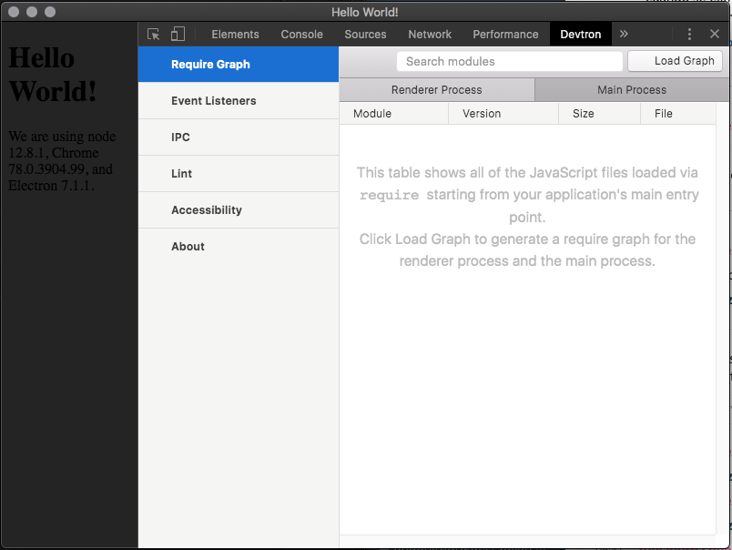

# Build an App with Electron and TypeScript - Getting Started

This article covers how to start a project to develop with Electron and TypeScript, first steps with Electron apps and how to debug an Electron app. This is part of a [post series about developing apps with Electron and TypeScript](https://github.com/AlbertoFdzM/time-tracker).


## Requirements

The environment/machine needs to have installed [NodeJS](https://nodejs.org/) v12 or higher.

The editor used for this articles is [VS Code](https://code.visualstudio.com/) and some sections will make use of its functionalities.

### Project Setup

In the project's directory (`~/develop/time-tracker`)

Install [TypeScript](https://www.typescriptlang.org/):
```bash
npm i -D typescript
```
<small>_**Note:** same as `npm install --save-dev typescript`_</small>

Create a [TypeScript config file](https://www.typescriptlang.org/docs/handbook/tsconfig-json.html).

**`/tsconfig.json`**
```json
{
  "compilerOptions": {
    "incremental": true,
    "target": "es2018",
    "lib": [
      "es2018"
    ],
    "module": "commonjs",
    "declaration": true,
    "declarationMap": true,
    "sourceMap": true,
    "outDir": "./dist",
    "rootDir": "./src",
    "composite": true,
    "strict": true,
    "noUnusedLocals": true,
    "noUnusedParameters": true,
    "noImplicitReturns": true,
    "noFallthroughCasesInSwitch": true,
    "moduleResolution": "node",
    "esModuleInterop": true,
    "experimentalDecorators": true,
    "emitDecoratorMetadata": true,
    "forceConsistentCasingInFileNames": true
  }
}
```

Install [Electron](https://electronjs.org/):
```bash
npm i -P electron
```
<small>_**Note:** same as `npm install --save-prod electron`_</small>

## Develop

### Most Basic Electron App

The easiest thing to do with Electron is to open a blank window.

The `App` class will be the main module for the project, for now it will only open an empty window when electron is ready.

**`/src/App.ts`**
```typescript
import Electron from 'electron';

/**
 * Main module for the project
 */
export class App {
  /**
   * Starts the app
   */
  public start(): void {
    Electron.app.on('ready', this.onReady);
  }

  /**
   * Callback for Electron.App "ready" event
   * https://electronjs.org/docs/api/app#event-ready
   */
  private onReady(): void {
    new Electron.BrowserWindow();
  }
}

```

Now to use this module a good practice is to have an executable Node script that runs it, they are usually placed in a `bin/` directory.

**`/src/bin/start.ts`**
```typescript
import { App } from './App';

const app: App = new App();
app.start();
```

Update package with build and start scripts.
 
**`/package.json`**
```json
{
  // ...
  "main": "dist/bin/start.js",
  "scripts": {
    "build": "tsc",
    "prestart": "npm run build",
    "start": "electron .",
    // ...
  },
  //...
}
```

And try it:
```bash
npm start
```

An empty window should appear:


### Rendering HTML in Electron

Electron's windows can load HTML files and render them.

Create a basic HTML file:
**`/index.html`**
```html
<!DOCTYPE html>
<html lang="en">
  <head>
    <meta charset="UTF-8">
    <title>Hello World!</title>
    <!-- https://electronjs.org/docs/tutorial/security#csp-meta-tag -->
    <meta http-equiv="Content-Security-Policy" content="script-src 'self' 'unsafe-inline';" />
  </head>
  <body>
    <h1>Hello World!</h1>
  </body>
</html>
```

Update `App` imports and `App.onReady` method:
**`/src/App.ts`**
```typescript
import Electron from 'electron';
import path from 'path'; // NodeJS path module

// ...
export class App {
  // ...
  private async onReady(): Promise<void> {
    const window: Electron.BrowserWindow = new Electron.BrowserWindow();

    await window.loadFile(path.join(__dirname, '../index.html'));
  }
}

```

Now if the app starts:
```bash
npm start
```

Should appear something like this:


In order to have integration with Node APIs, Electron's window needs to receive some options.

Update `App.onReady` method
**`/src/App.ts`**
```typescript
//...

export class App {

  //...

  private async onReady(): Promise<void> {
    const options: Electron.BrowserWindowConstructorOptions = {
      webPreferences: {
        nodeIntegration: true
      }
    };

    const window: Electron.BrowserWindow = new Electron.BrowserWindow(options);

    await window.loadFile(path.join(__dirname, '../index.html'));
  }
}
```

And now the HTML has access to NodeJS APIs.

Update `index.html` file

**`/index.html`**
```html
<!DOCTYPE html>
<html lang="en">
  <head>
    <!-- ... -->
  </head>
  <body>
    <h1>Hello World!</h1>
    We are using node <script>document.write(process.versions.node)</script>,
    Chrome <script>document.write(process.versions.chrome)</script>,
    and Electron <script>document.write(process.versions.electron)</script>.
  </body>
</html>
```

When App starts:


## Debugging and AppConfig

There are some debugging tools for Electron ([`devtron`](https://github.com/electron-userland/devtron) and [`electron-debug`](https://github.com/sindresorhus/electron-debug)).
```bash
npm i -D devtron electron-debug
```

To activate this debugging tools some short of config will need to be passed to `App` module:
**`/src/AppConfig.ts`**
```typescript
/**
 * App module configuration
 */
export interface AppConfig {
  /**
   * Enables debugging tools
   */
  isDebugEnabled: boolean;
}

```

**`/src/App.ts`**
```typescript
//...

import { AppConfig } from './AppConfig';
import ElectronDebug from 'electron-debug';

// ...

class App {

  constructor (private config: AppConfig) {}

  public start(): void {
    if (this.config.isDebugEnabled) {
      // https://www.typescriptlang.org/docs/handbook/modules.html#optional-module-loading-and-other-advanced-loading-scenarios
      const electronDebug: typeof ElectronDebug = require('electron-debug');

      electronDebug();
    }

    // ...
  }

  // ...

}
```

`AppConfig` can be created before instantiating the `App` module in the `start` script:
**`/src/bin/start.ts`**
```typescript
import { App } from '../App';
import { AppConfig } from '../AppConfig';

const isDebugEnabled: boolean = process.env.DEBUG_ENABLED === 'true';
const config: AppConfig = {
  isDebugEnabled
};

const app: App = new App(config);
app.start();
```

Now the `start` script needs to receive this value through environment variables.
**`/package.json`**
```json
{
  // ...
  "scripts": {
    // ...
    "start": "DEBUG_ENABLED=true electron .",
    // ...
  }
  // ...
}
```

When `electron-debug` is activated will detect `devtron` and activates it too. Now when the Electron app starts, it will have the devtools panel open and a "Devtron" tab in it:


### Debugging Electron in TypeScript with VS Code

To use [VS Code debugging functionality](https://code.visualstudio.com/docs/editor/debugging) first the project needs to configure the NPM build script to be used by [VS Code tasks](https://code.visualstudio.com/docs/editor/tasks).

**`/.vscode/tasks.json`**
```json
{
  // See https://go.microsoft.com/fwlink/?LinkId=733558 
  // for the documentation about the tasks.json format
  "version": "2.0.0",
  "tasks": [
    {
      "type": "npm",
      "script": "build",
      "problemMatcher": [
        "$tsc"
      ],
      "group": {
        "kind": "build",
        "isDefault": true
      }
    }
  ]
}
```

To check if the task works, with VS Code open press <kbd>Cmd</kbd>/<kbd>Ctrl</kbd> + <kbd>Shift</kbd> + <kbd>B</kbd>, VS Code should open a terminal with the build output.

Next a [VS Code launch file](https://code.visualstudio.com/docs/nodejs/nodejs-debugging) needs to be configured.

**`/.vscode/launch.json`**
```json
{
  // Use IntelliSense to learn about possible attributes.
  // Hover to view descriptions of existing attributes.
  // For more information, visit: https://go.microsoft.com/fwlink/?linkid=830387
  "version": "0.2.0",
  "configurations": [
    {
      "type": "node",
      "request": "launch",
      "name": "Debug",
      "runtimeExecutable": "${workspaceFolder}/node_modules/.bin/electron",
      "preLaunchTask": "${defaultBuildTask}",
      "program": "${workspaceFolder}/dist/bin/start.js",
      "skipFiles": [
        "<node_internals>/**"
      ],
      "sourceMaps": true,
      "outFiles": [
        "${workspaceFolder}/dist/**/*.js"
      ],
      "env": {
        "DEBUG_ENABLED": true
      }
    }
  ]
}
```

When pressing <kbd>F5</kbd> the Electron app should start with inspection mode, and debugging tools enabled.


## Closure

This are the basic steps to start developing with Electron with TypeScript.

All the generated code of this post can be found on [GitHub AlbertoFdzM/time-tracker repository](https://github.com/AlbertoFdzM/time-tracker/tree/post/01).